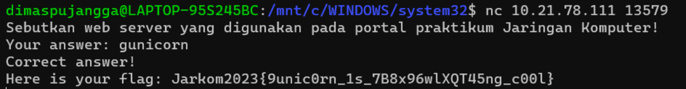

# Jarkom-Modul-1-B20-2023

## Informasi Kelompok

| Nama | NRP |
| ---- | --- |
| Richie Seputro | 5025211213 |
| Dimas Aria Pujangga | 5025211212 |

## Penjelasan

1. User melakukan berbagai aktivitas dengan menggunakan protokol FTP. Salah satunya adalah mengunggah suatu file.

   a. Berapakah sequence number (raw) pada packet yang menunjukkan aktivitas tersebut? 

      → 258040667	

   b. Berapakah acknowledge number (raw) pada packet yang menunjukkan aktivitas tersebut? 

      → 1044861039

   c. Berapakah sequence number (raw) pada packet yang menunjukkan response dari aktivitas tersebut?

      → 1044861039

   d. Berapakah acknowledge number (raw) pada packet yang menunjukkan response dari aktivitas tersebut?

      → 258040696

   Langkah pengerjaan: 

   - Download file capture nomor 1 lalu buka menggunakan wireshark.
   - Filter packets protokol FTP.
   - Double click paket no. 147 kemudian lihat seq dan acknowledge number (raw)-nya untuk soal a dan b.
   - Double click paket no. 149 kemudian lihat seq dan acknowledge number (raw)-nya untuk soal c dan d.

   Screenshot:

   

   

   

2. Sebutkan web server yang digunakan pada portal praktikum Jaringan Komputer!

   → gunicorn

   Langkah Pengerjaan:

   - Download kemudian buka file pcap nomor 2 menggunakan wireshark
   - Filter menggunakan “http contains "10.21.78.111"
   - Klik kanan salah satu paket lalu follow TCP STREAM
   
   Screenshot:

   

   

3. Dapin sedang belajar analisis jaringan. Bantulah Dapin untuk mengerjakan soal berikut:

   a. Berapa banyak paket yang tercapture dengan IP source maupun destination address adalah 239.255.255.250 dengan port 3702?

   → 21

   b. Protokol layer transport apa yang digunakan?
   
   → UDP
   
   Screenshot:

   

   

4. Berapa nilai checksum yang didapat dari header pada paket nomor 130?

   → 0x18e5
   
   Langkah Pengerjaan:

   - Download file pcap nomor 4.
   - Buka file pcap dengan Wireshark.
   - Double click di paket nomor 130.
   - Pada bagian User Datagram Protocol, ada sub-bagian Checksum.

   Screenshot:

   
   
   

5. Elshe menemukan suatu file packet capture yang menarik. Bantulah Elshe untuk menganalisis file packet capture tersebut.

   Pada soal ini kita mendapat file capture tetapi untuk mendapatkan pertanyaan dari soal, kita harus unlock zip file yang memiliki password. Pertama, kita buka terlebih dahulu file capture untuk nomor 5 di wireshark. Setelah itu, kita pilih salah satu packet kemudian klik kanan lalu follow TCP Stream. 
   
   
   
   Kita sudah berhasil mendapatkan password untuk membuka zip file, tetapi kita harus decode passwordnya terlebih dahulu di Base64. 
   
   .png)

   Setelah kita decode, barulah kita mendapatkan passowrd untuk membuka zip filenya dan mendapat pertanyaannya sebagai berikut.
   
   a. Berapa banyak packet yang berhasil di capture dari file pcap tersebut?
   → 60

   Screenshot:
   
   

   b. Port berapakah pada server yang digunakan untuk service SMTP?
   → 25

   Screenshot:
   
   

   c. Dari semua alamat IP yang tercapture, IP berapakah yang merupakan public IP?
   → 74.53.140.153

   Screenshot:
   
   

6. Seorang anak bernama Udin Berteman dengan SlameT yang merupakan seorang penggemar film detektif. sebagai teman yang baik, Ia selalu mengajak slamet untuk bermain valoranT bersama. suatu malam, terjadi sebuah hal yang tak terdUga. ketika udin mereka membuka game tersebut, laptop udin menunjukkan sebuah field text dan Sebuah kode Invalid bertuliskan "server SOURCE ADDRESS 7812 is invalid". ketika ditelusuri di google, hasil pencarian hanya menampilkan a1 e5 u21. jiwa detektif slamet pun bergejolak. bantulah udin dan slamet untuk menemukan solusi kode error tersebut.

Langkah Pengerjaan:
   
Clue soal nomor 6 adalah:
- "server SOURCE ADDRESS 7812 is invalid"
Pada clue di atas bisa disimpulkan bahwa kita hanya perlu fokus pada source address pada packet no. 7812
- a1 e5 u21
Pada clue berikut kita perlu mengurutkan angka-angka sesuai alphabet.

A = 1		H = 8		O = 15		V = 22
B = 2		I = 9		P = 16		W = 23
C = 3		J = 10	Q = 17		X = 24
D = 4		K = 11	R = 18		Y = 25
E = 5		L = 12	S = 19		Z = 26
F = 6		M = 13	T = 20
G = 7		N = 14	U =21

Kemudian, kita melakukan filter untuk mencari packet no. 7812 dengan menggunakan query frame.number==7812.

Setelah mendapat packet no. 7812, bisa kita lihat source address paket tersebut yaitu 104.18.14.101, setelah itu kita ubah angka-angka tersebut menjadi alphabet.

10 = J
4 = D
18 = R
14 = N
10 = J
1 = A

Setelah diurutkan, dapatlah hasilnya yaitu JDRNJA.

7. Berapa jumlah packet yang menuju IP 184.87.193.88?

   → ip.dst == 184.87.193.88
   
   → Terdapat 6 packet yang menuju IP tersebut.

   Screenshot:

   

8. Berikan kueri filter sehingga wireshark hanya mengambil semua protokol paket yang menuju port 80! (Jika terdapat lebih dari 1 port, maka urutkan sesuai dengan abjad)

   → tcp.port == 80 || udp.port == 80

   Screenshot:

   

   

9. Berikan kueri filter sehingga wireshark hanya mengambil paket yang berasal dari alamat 10.51.40.1 tetapi tidak menuju ke alamat 10.39.55.34!

   → ip.src == 10.51.40.1 && ip.dst != 10.39.55.34

   Screenshot:

   

   

10. Sebutkan kredensial yang benar ketika user mencoba login menggunakan Telnet

    → dhafin:kesayangannyak0k0

    Langkah Pengerjaan:

	- Download file pcap nomor 10.
	- Buka file pcap dengan Wireshark.
	- Cek setiap paket yang ber-protocol TELNET.
	- Coba satu-satu setiap kredensial yang ditemukan ke server nc.

    Screenshot:

    

    
